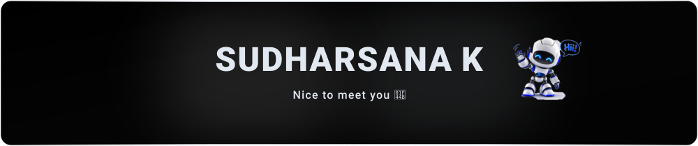
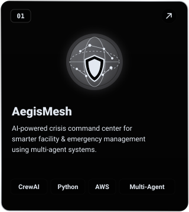
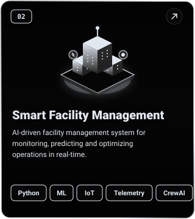
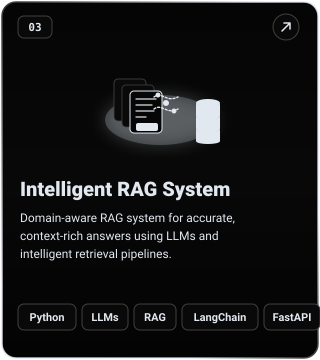
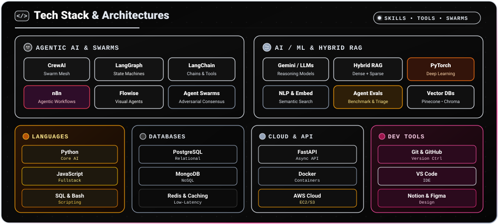
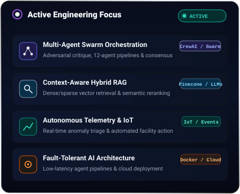
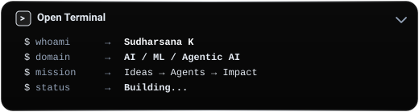
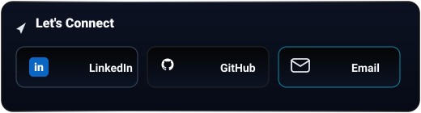
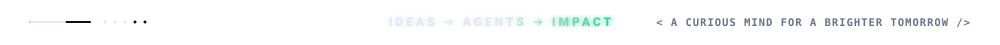

<!-- Header Hero Banner -->

 

<!-- Featured Projects Header -->

<!-- Featured Projects (3-Column Layout) -->
<table border="0" cellpadding="0" cellspacing="6" width="100%">
  <tr>
    <td width="33.3%" align="center" valign="top">
      
    </td>
    <td width="33.3%" align="center" valign="top">
      
    </td>
    <td width="33.3%" align="center" valign="top">
      
    </td>
  </tr>
</table>

 

<!-- Full-Width Tech Stack -->

 

<!-- Current Focus & Terminal/Connect (2-Column Layout) -->
<table border="0" cellpadding="0" cellspacing="6" width="100%">
  <tr>
    <td width="48%" align="center" valign="top">
      
    </td>
    <td width="52%" align="center" valign="top">
      
       
      
    </td>
  </tr>
</table>

 

<!-- Footer -->
 Agents -> Impact" />

