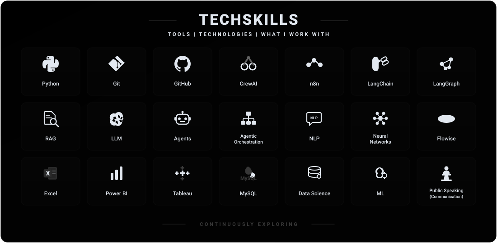

<div align="center">




</div>

<br>

---

### 03 &nbsp;·&nbsp; FEATURED PROJECTS

<br>

#### `PROJECT 01` &nbsp;·&nbsp; **FLAGSHIP ARCHITECTURE**

## [AegisMesh — Autonomous Multi-Agent Crisis Command Center](https://github.com/Sudharsana125/AgeisMesh_Multi-Agent_Crisis_Command_Center.)

> Autonomous multi-agent pipeline coordinating 12 specialized agents with adversarial critique to detect, triage, and resolve complex infrastructure failures in real time.

`CrewAI` &nbsp;·&nbsp; `Google Gemini` &nbsp;·&nbsp; `FastAPI` &nbsp;·&nbsp; `Exa API` &nbsp;·&nbsp; `uv`

&nbsp;[**Explore Repository →**](https://github.com/Sudharsana125/AgeisMesh_Multi-Agent_Crisis_Command_Center.) &nbsp;·&nbsp; [**Inspect Agent Spec (`AGENTS.md`) →**](https://github.com/Sudharsana125/AgeisMesh_Multi-Agent_Crisis_Command_Center./blob/main/AGENTS.md)

<details>
<summary><b><code>▶ INTERACTIVE PIPELINE SPECIFICATION</code></b></summary>

```
[SYSTEM INGESTION]
  │
  ├── ⚡ Telemetry Ingestion Agent  ── Ingests live cross-domain logs & network traffic
  ├── 🔍 Anomaly Correlator Agent   ── Correlates spikes with known outage topologies
  ├── 🛡️ Adversarial Critique Agent ── Evaluates mitigation hypothesis & tests edge-cases
  └── 🚀 Automated Dispatcher       ── Executes verified remediation runbooks
```
</details>

<br>

---

<br>

#### `PROJECT 02` &nbsp;·&nbsp; **REASONING ENGINE**

### [AI Debate Arena — Multi-Agent Decision Engine](https://github.com/Sudharsana125/AI-Debate-Arena)

> Dialectical decision-support system pitting specialized Pro, Contra, Risk, and Judicial agents in structured debate to surface balanced, low-bias reasoning.

`Google Gemini` &nbsp;·&nbsp; `Multi-Agent Reasoning` &nbsp;·&nbsp; `Flask` &nbsp;·&nbsp; `Python`

&nbsp;[**Explore Repository →**](https://github.com/Sudharsana125/AI-Debate-Arena) &nbsp;·&nbsp; [**View Debate Engine (`debate_engine.py`) →**](https://github.com/Sudharsana125/AI-Debate-Arena/blob/main/debate_engine.py)

<details>
<summary><b><code>▶ INTERACTIVE DIALECTICAL FLOW</code></b></summary>

```
[USER QUERY / PROPOSITION]
  │
  ├── 🟢 Pro Agent       ── Argues feasibility, strategic gains & affirmative points
  ├── 🔴 Contra Agent    ── Formulates aggressive counter-arguments & failure points
  ├── ⚠️ Risk Agent      ── Quantifies second-order systemic exposure & vulnerabilities
  └── ⚖️ Judicial Agent  ── Delivers final verdict with synthesized objective trade-offs
```
</details>

<br>

---

<br>

#### `PROJECT 03` &nbsp;·&nbsp; **TELEMETRY & DISPATCH**

### [Smart Facility AI Hub — IoT Telemetry & Agent Dispatch](https://github.com/Sudharsana125/Smart_Facility_Agents_Project)

> Facility intelligence platform streaming real-time IoT telemetry to autonomous agents for anomaly mitigation, dynamic sentiment triage, and thermal energy optimization.

`Autonomous Agents` &nbsp;·&nbsp; `IoT Telemetry` &nbsp;·&nbsp; `Python` &nbsp;·&nbsp; `JavaScript`

&nbsp;[**Explore Repository →**](https://github.com/Sudharsana125/Smart_Facility_Agents_Project) &nbsp;·&nbsp; [**Inspect Telemetry Engine (`realtime_engine.py`) →**](https://github.com/Sudharsana125/Smart_Facility_Agents_Project/blob/main/realtime_engine.py)

<details>
<summary><b><code>▶ INTERACTIVE FACILITY PIPELINE</code></b></summary>

```
[IOT SENSORS & USER TICKETS]
  │
  ├── 📡 Sensor Telemetry Hub   ── Continuously ingests power, temperature & airflow metrics
  ├── 🧠 Complaint Classifier    ── Analyzes tenant reports using NLP sentiment ranking
  └── ⚙️ Thermal Control Agent  ── Dynamically adjusts HVAC zones to reduce energy waste
```
</details>

<br>

---

### 04 &nbsp;·&nbsp; GITHUB STATUS

<br>

<div align="center">

<picture>
  <source media="(prefers-color-scheme: dark)" srcset="https://raw.githubusercontent.com/Sudharsana125/Sudharsana125/output/github-contribution-grid-snake-dark.svg" />
  <source media="(prefers-color-scheme: light)" srcset="https://raw.githubusercontent.com/Sudharsana125/Sudharsana125/output/github-contribution-grid-snake.svg" />
  
</picture>

<br>

<sub>Live contribution grid with moving snake animation &nbsp;·&nbsp; Autonomous Agent Architectures & Multi-Agent Pipelines</sub>

</div>

<br>

---

<br>

<div align="center">

### Let's build something useful.

<br>

<a href="https://github.com/Sudharsana125"></a>
&nbsp;&nbsp;
<a href="https://www.linkedin.com/in/sudharsana-k/"></a>
&nbsp;&nbsp;
<a href="mailto:sudharsanak13@gmail.com?subject=Collaborating%20on%20Agentic%20AI"></a>

<br>

</div>
