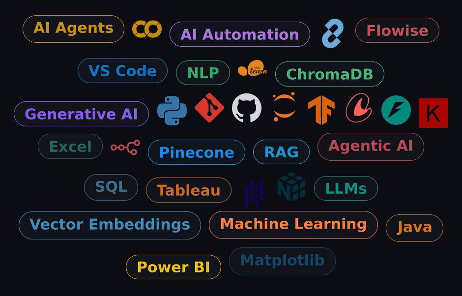

<!--Banner-->

<!--Night Owl image-->

  

<h2> 👩‍💻I'm Sudharsana!</h2>

I'm an AI & Data Science undergraduate at KGiSL Institute of Technology, Coimbatore, building Generative AI systems — Retrieval-Augmented Generation, LLM orchestration, and AI Agents — and turning them into real, working applications.

✨ Building intelligent systems, one project at a time  
🌱 Currently learning Agentic AI, Advanced RAG, and System Design for AI applications  
🤖 Main project: an Intelligent Customer Support Chatbot powered by RAG (ChromaDB + Sentence Transformers + Streamlit + Gemini API)  
📖 Published a book chapter with ESN Publications  
🏆 Presented and competed at hackathons/conferences including RABSH and Pyexpo  
💻 Visit my GitHub for more of my work  

<!--Profile Count Badge-->

  

<!--Tech Stack Section-->

<h2 align="center">⚡ Tᴇᴄʜ Sᴛᴀᴄᴋ & Sᴋɪʟʟs ⚡</h2>

  

<h2>(●'◡'●)Thought of the Day </h2>

  

  

<h2> 🤟Connect With Me </h2>

  
  
  

