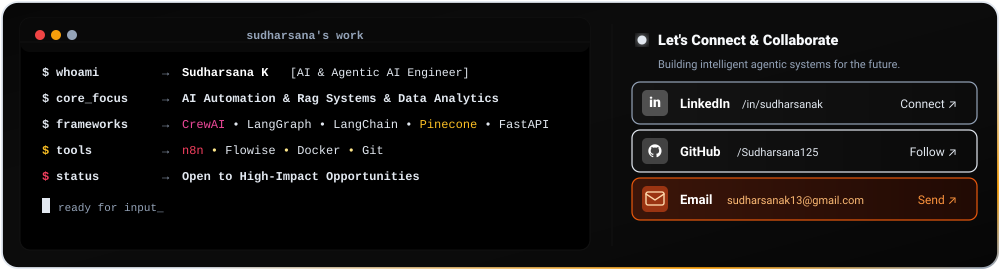

<!-- Header Hero Banner -->

 

<!-- Featured Projects Header -->

<!-- Featured Projects (3-Column Layout) -->
<table border="0" cellpadding="0" cellspacing="6" width="100%">
  <tr>
    <td width="33.3%" align="center" valign="top">
      
    </td>
    <td width="33.3%" align="center" valign="top">
      
    </td>
    <td width="33.3%" align="center" valign="top">
      
    </td>
  </tr>
</table>

 

<!-- Full-Width Tech Stack -->
<table width="100%" cellpadding="0" cellspacing="0" border="0">
<tr><td align="center" style="background:#070a16;border-radius:16px;padding:24px 20px;border:1.5px solid #38bdf8;">

<code>&lt;/&gt;</code>&nbsp;&nbsp;<strong>Tech Stack &amp; Architectures</strong>&nbsp;&nbsp;<code>SKILLS • TOOLS • SWARMS</code>

  

<!-- ROW 1 -->
<table width="100%" cellpadding="6" cellspacing="0" border="0">
<tr valign="top">

<!-- AGENTIC AI & SWARMS -->
<td width="50%" align="center">

**🤖 AGENTIC AI & SWARMS**

 

 

</td>

<!-- AI / ML & HYBRID RAG -->
<td width="50%" align="center">

**🧠 AI / ML & HYBRID RAG**

 

 

</td>
</tr>
</table>

 

<!-- ROW 2 -->
<table width="100%" cellpadding="6" cellspacing="0" border="0">
<tr valign="top">

<!-- LANGUAGES -->
<td width="25%" align="center">

**💛 LANGUAGES**

 

</td>

<!-- DATABASES -->
<td width="25%" align="center">

**🟢 DATABASES**

 

</td>

<!-- CLOUD & API -->
<td width="25%" align="center">

**☁️ CLOUD & API**

 

</td>

<!-- DEV TOOLS -->
<td width="25%" align="center">

**🛠️ DEV TOOLS**

 

</td>
</tr>
</table>

</td></tr>
</table>

 

<!-- Full-Width Open Terminal & Connect Console -->

 

<!-- Footer -->
 Agents -> Impact" />

