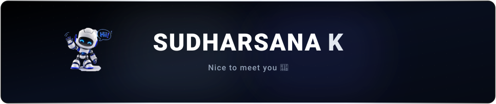
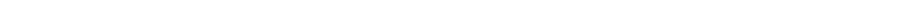
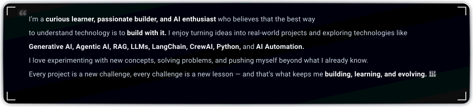
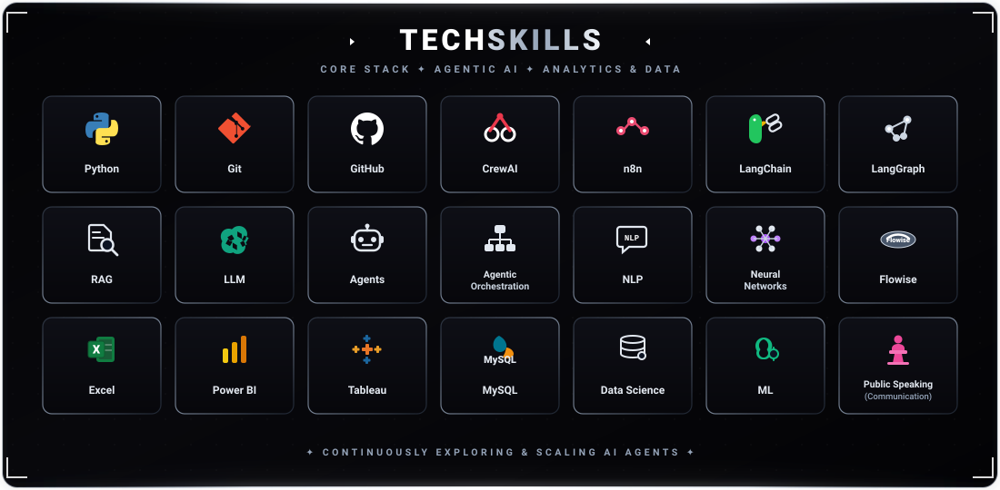

  <!-- ==================== HERO BANNER ==================== -->
  

   

  <!-- ==================== DIVIDER ==================== -->
  

   

  <!-- ==================== ABOUT ME ==================== -->
  
  
   
  
  

   

  <!-- ==================== DIVIDER ==================== -->
  

   

  <!-- ==================== TECH STACK (21 EXACT SKILLS) ==================== -->
  

   

  

   

  <!-- ==================== DIVIDER ==================== -->
  

   

  <!-- ==================== GITHUB CONTRIBUTION SNAKE ==================== -->
  

   

  

   

  <!-- ==================== DIVIDER ==================== -->
  

   

  <!-- ==================== CONNECT WITH ME ==================== -->
  

   

  
  &nbsp;&nbsp;
  
  &nbsp;&nbsp;
  

    

  <!-- ==================== FOOTER ==================== -->
  

    ✦ DESIGNED WITH OBSESSIVE PRECISION IN BLACK &amp; METALLIC SILVER ✦
  

